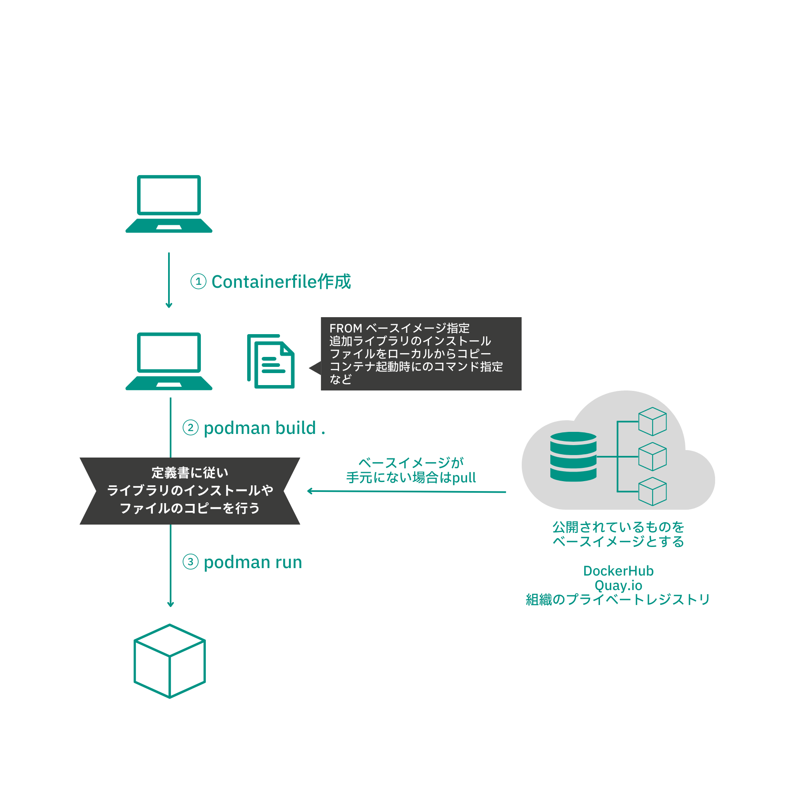

# Containerfileを作ってみよう

本研修の第一歩として、コンテナの設計書を作成し、実際にコンテナを動かしてみましょう。コンテナはそれぞれが独立したシステム実行環境です。そのため、システムの実行に必要なライブラリや基本コマンドなどが**すべて**入っている必要があります。0から必要なものを用意するのは手間がかかるため、コンテナを作成する際は数多く用意されている大元になるイメージを使用します。ベースイメージと呼ばれるコンテナの元を選択し、その上に追加で必要なライブラリのインストール、独自に開発したアプリケーションを詰め込んでカスタマイズしていきます。

1. コンテナファイル(定義書)の作成
2. コンテナイメージのビルド
3. イメージをRunしてコンテナ実行



今回はFedoraというLinuxディストリビューションをベースイメージとして使用し、その上に追加必要なライブラリをインストールしていきます。ローカル環境からコピーしたファイル内の文字列をアスキーアートで出力するコンテナを開発していきます。 


## 1. コンテナファイルの作成
任意のフォルダに<span style="color: orange; "> Containerfile </span>というファイルを作ります。
Containerfile（Dockerfile）はコンテナイメージをビルドするときの設計書になります。


```bash
mkdir ~/work/container-handson
cd ~/work/container-handson
echo "Hello World" > messagefile
vi Containerfile
```

Containerfileには、以下を記載します。
```yaml linenums="1" title="Containerfile"
FROM fedora
RUN yum -y update && yum -y install figlet
COPY ./messagefile /messagefile
CMD cat /messagefile | figlet
```

  
|  コマンド  |  概要  |
| ---- | ---- |
|  `From <イメージ:タグ>` |  ベースイメージ（作成するイメージの元となるイメージ）を指定。<br>例)From fedoraと指定した場合は、公開されているfedora linuxのイメージをベースとし、自分のイメージを作成していく。  |
|  `RUN <コマンド>`  |  ベースイメージ上でコマンドを実行する。複数指定可能  |
|  `COPY <ソース> <コンテナ内の宛先>` |  ファイル、ディレクトリ、tarファイル等をコンテナ内の宛先へコピーする  |
|  `CMD <コマンド>`   |  コンテナの実行時に実行されるコマンドを指定する  |
|  `ENV <key>=<value>`|  コンテナ内の環境変数を指定する  |


上表では代表的なコマンドの概要をまとめました。Containerfileには多くのコマンドがあるため、詳細は[Qiita記事](https://qiita.com/mintak21/items/a6766e3efd6730c9519d)や公式サイトをご参照ください。ContainerfileとDockerfileで利用可能なコマンドは同じです。そのため、Podman buildを行う際、Dockerfileを使用してコンテナイメージを作成することも可能です。  

[Dockerfileリファレンス(日本語翻訳版):](https://docs.docker.jp/engine/reference/builder.html) 
  
---
## 2. コンテナイメージのビルド
それでは、作成したContainerfileをもとに、コンテナイメージを作成(Build)していきましょう。イメージビルドを行うコマンドは <span style="color: orange; ">podman image build</span>です。このとき、作成するイメージ名やタグ名を指定することができます。Containerfileとイメージ内に含めたいファイル郡を一つのディレクトリに配置し、それをビルドしていきます。
  
  
  
|  コマンド  |  概要  |
| ---- | ---- |
|  podman image build -t リポジトリー/イメージ名:タグ .| カレントディレクトリのContainerfileからイメージをビルドする |


  
今回は、first-hwという名前に1.0というタグをつけたイメージを作成します。Containerfileを作成したディレクトリにいる状態で、以下コマンドを実行してください。

```shell
podman build -t first-hw:1.0 .
```

<details>
<summary>実行例</summary>

```shell title="build実行結果"
$ podman build .
STEP 1/4: FROM fedora
STEP 2/4: RUN yum -y update && yum -y install figlet
Fedora 38 - x86_64                              3.0 MB/s |  66 MB     00:21
Fedora 38 openh264 (From Cisco) - x86_64        1.4 kB/s | 2.5 kB     00:01
Fedora Modular 38 - x86_64                      1.4 MB/s | 2.3 MB     00:01
Fedora 38 - x86_64 - Updates                    2.9 MB/s | 7.1 MB     00:02
Fedora Modular 38 - x86_64 - Updates            388  B/s | 257  B     00:00
Last metadata expiration check: 0:00:01 ago on Sun Apr 16 07:01:24 2023.
Dependencies resolved.
================================================================================
 Package             Architecture  Version                 Repository      Size
================================================================================
Upgrading:
 libgcrypt           x86_64        1.10.2-1.fc38           updates        514 k
 libgpg-error        x86_64        1.47-1.fc38             updates        230 k
 python3             x86_64        3.11.3-1.fc38           updates         28 k
 python3-libs        x86_64        3.11.3-1.fc38           updates        9.6 M
 rpm-sequoia         x86_64        1.4.0-1.fc38            updates        851 k

Transaction Summary
================================================================================
Upgrade  5 Packages

Total download size: 11 M
Downloading Packages:
(1/5): python3-3.11.3-1.fc38.x86_64.rpm          96 kB/s |  28 kB     00:00
(2/5): libgpg-error-1.47-1.fc38.x86_64.rpm      676 kB/s | 230 kB     00:00
(3/5): libgcrypt-1.10.2-1.fc38.x86_64.rpm       1.3 MB/s | 514 kB     00:00
(4/5): rpm-sequoia-1.4.0-1.fc38.x86_64.rpm      1.9 MB/s | 851 kB     00:00
(5/5): python3-libs-3.11.3-1.fc38.x86_64.rpm    4.7 MB/s | 9.6 MB     00:02
--------------------------------------------------------------------------------
Total                                           3.8 MB/s |  11 MB     00:02
Running transaction check
Transaction check succeeded.
Running transaction test
Transaction test succeeded.
Running transaction
  Preparing        :                                                        1/1
  Upgrading        : python3-libs-3.11.3-1.fc38.x86_64                     1/10
  Upgrading        : python3-3.11.3-1.fc38.x86_64                          2/10
  Upgrading        : libgpg-error-1.47-1.fc38.x86_64                       3/10
  Upgrading        : libgcrypt-1.10.2-1.fc38.x86_64                        4/10
  Upgrading        : rpm-sequoia-1.4.0-1.fc38.x86_64                       5/10
  Cleanup          : python3-3.11.2-1.fc38.x86_64                          6/10
  Cleanup          : libgcrypt-1.10.1-7.fc38.x86_64                        7/10
  Cleanup          : libgpg-error-1.46-2.fc38.x86_64                       8/10
  Cleanup          : python3-libs-3.11.2-1.fc38.x86_64                     9/10
  Cleanup          : rpm-sequoia-1.3.0-1.fc38.x86_64                      10/10
  Running scriptlet: rpm-sequoia-1.3.0-1.fc38.x86_64                      10/10
  Verifying        : libgcrypt-1.10.2-1.fc38.x86_64                        1/10
  Verifying        : libgcrypt-1.10.1-7.fc38.x86_64                        2/10
  Verifying        : libgpg-error-1.47-1.fc38.x86_64                       3/10
  Verifying        : libgpg-error-1.46-2.fc38.x86_64                       4/10
  Verifying        : python3-3.11.3-1.fc38.x86_64                          5/10
  Verifying        : python3-3.11.2-1.fc38.x86_64                          6/10
  Verifying        : python3-libs-3.11.3-1.fc38.x86_64                     7/10
  Verifying        : python3-libs-3.11.2-1.fc38.x86_64                     8/10
  Verifying        : rpm-sequoia-1.4.0-1.fc38.x86_64                       9/10
  Verifying        : rpm-sequoia-1.3.0-1.fc38.x86_64                      10/10

Upgraded:
  libgcrypt-1.10.2-1.fc38.x86_64        libgpg-error-1.47-1.fc38.x86_64
  python3-3.11.3-1.fc38.x86_64          python3-libs-3.11.3-1.fc38.x86_64
  rpm-sequoia-1.4.0-1.fc38.x86_64

Complete!
Last metadata expiration check: 0:00:12 ago on Sun Apr 16 07:01:24 2023.
Dependencies resolved.
================================================================================
 Package    Arch       Version                                 Repository  Size
================================================================================
Installing:
 figlet     x86_64     2.2.5-25.20151018gita565ae1.fc38        fedora     137 k

Transaction Summary
================================================================================
Install  1 Package

Total download size: 137 k
Installed size: 666 k
Downloading Packages:
figlet-2.2.5-25.20151018gita565ae1.fc38.x86_64. 1.2 MB/s | 137 kB     00:00
--------------------------------------------------------------------------------
Total                                           193 kB/s | 137 kB     00:00
Running transaction check
Transaction check succeeded.
Running transaction test
Transaction test succeeded.
Running transaction
  Preparing        :                                                        1/1
  Installing       : figlet-2.2.5-25.20151018gita565ae1.fc38.x86_64         1/1
  Running scriptlet: figlet-2.2.5-25.20151018gita565ae1.fc38.x86_64         1/1
  Verifying        : figlet-2.2.5-25.20151018gita565ae1.fc38.x86_64         1/1

Installed:
  figlet-2.2.5-25.20151018gita565ae1.fc38.x86_64

Complete!
--> Pushing cache []:b5be31b75a7b031ee291e82907b39c9103ca848683d349aaef5c9e28ad94388b
--> 70ea8b96d07
STEP 3/4: ADD ./messagefile /messagefile
--> Pushing cache []:10ab90b4d35516f71a092ba0348367d3f0a1e5194fc36b5b321aeab8ba0202b0
--> 08d3196efe3
STEP 4/4: CMD cat /messagefile | figlet
COMMIT
--> Pushing cache []:08354a00bfa748c1dad8d8833f91c75f3a6ccefb370df730735711ecb461e1dd
--> 016f667375a
016f667375a74fb752d4f929f08b6b5a90ca319b178d4fca693fba152fde84e0
```
</details>


#### 作成したイメージの確認

作成したコンテナイメージを確認します。現在の環境に導入されているイメージの一覧を取得するには、`podman image ls`コマンドを使用します。実行してみると、指定したイメージ名称とタグ、イメージIDと作成時間が表示されるはずです。  
イメージIDはランダムな値が割り振られています。イメージ名を指定しないでビルドを行うと、Repository列は<None>になります。この場合はイメージIDを指定し、ビルド済みのイメージにタグやイメージ名をつけ直すことができます。実行するイメージをIDで実行することもできますが、名前とタグを指定して行うことが一般的です。  

```shell-session
$ podman image ls
REPOSITORY                                       TAG               IMAGE ID      CREATED         SIZE
localhost/first-hw                               1.0               2447f85fe621  59 seconds ago  525 MB
```

---
## 3. コンテナの実行
  
ここまででイメージの作成が完了しました！それでは、早速コンテナを実行してみましょう。`podman run 実行したいイメージ名:タグ` を実行してください

```
podman run first-hw:1.0
```

上手くコンテナが動くと、以下のようなHello WorldのAAAが表示されます。
  
```
$ podman run hw:1.0
 _   _      _ _        __        __         _       _
| | | | ___| | | ___   \ \      / /__  _ __| | ____| |
| |_| |/ _ \ | |/ _ \   \ \ /\ / / _ \| '__| |/ / _` |
|  _  |  __/ | | (_) |   \ V  V / (_) | |  |   < (_| |
|_| |_|\___|_|_|\___/     \_/\_/ \___/|_|  |_|\_\__,_|


```

ここまで実施した内容をまとめます。  
  
1. Fedoraをベースイメージとし、追加に必要なライブラリをインストール、文字列ファイルの内容を出力する単純なContainerfileを作成する
2. Containerfileの記述をもとに、実際のイメージをビルドする
3. ビルドじたイメージをコンテナとして実行する


今回ベースイメージとして使用したFedoraは、基本的なLinuxディストリビューションですが、アプリケーションが含まれたイメージも数多く公開されています。皆さんがお使いのアプリケーションも、イメージレジストリで公開されているかもしれません。興味があれば、どんなイメージがあるのかあるのか確認してください。IBMも多くのソフトウェアをコンテナ化して公開しています。    
- [Dockerhub](https://hub.docker.com/search?q=&type=image)  
- [Quai.io](https://quay.io/search?page=2)


!!! success

    最初の一歩は完了です！次ページの**コンテナビルドその2**では、カスタムアプリケーションを含んだイメージをビルドしていきます。また、アプリを含んだコンテナを起動する際にボリュームやネットワークを指定する方法を学びます。


