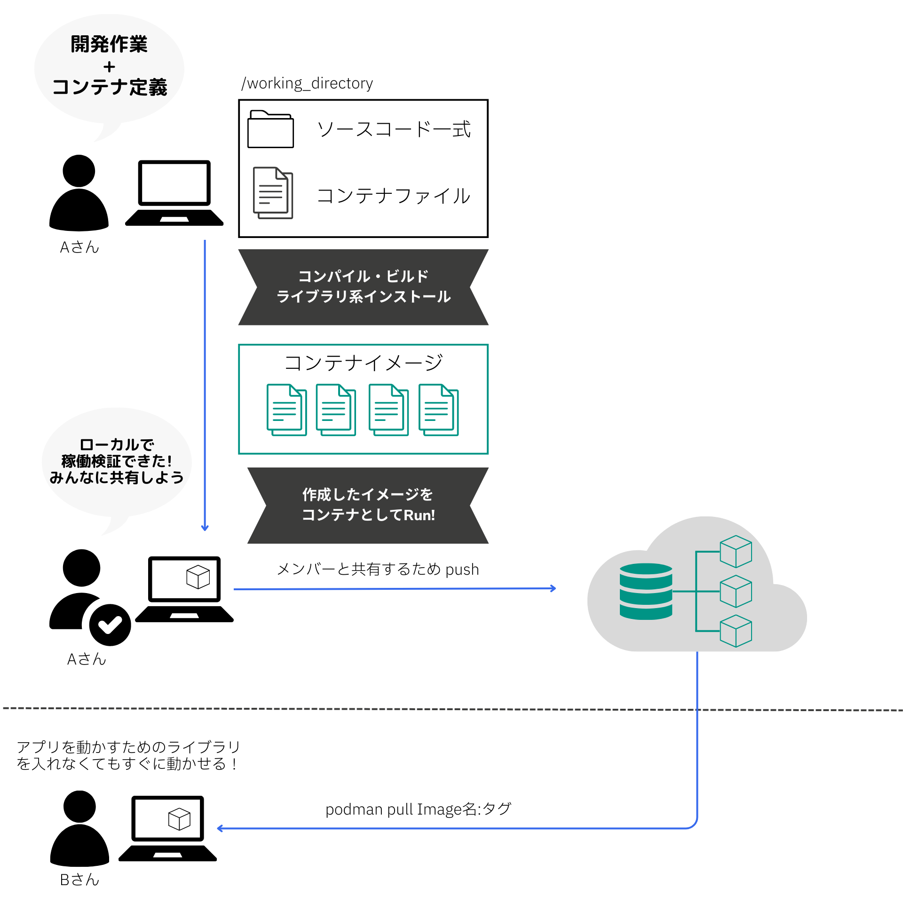

# アプリケーションを含んだコンテナを作成する

アプリケーションを含んだコンテナを作成するときも、基本的な流れは同じです。以下では、進め方の例を説明しています。

- 開発チームがアプリケーションのソースコードを開発、修正します
- アプリケーションに必要なライブラリのインストール、ランタイムの設定などをコンテナファイルに記載します
- コンテナビルドを実施し、イメージを作成します
- 開発環境でコンテナの稼働確認を行います
- 組織で用意したコンテナリポジトリーにイメージをPUSHします
- 他のメンバーはイメージをPULLし、自分の環境でコンテナを起動します




## アプリケーションを含んだコンテナイメージのビルド

それではアプリを含んだコンテナを作成していきましょう。Node.jsイメージをベースとして使用し、アクセスに対してローカルで用意したindex.htmlを返却するHTTPサーバーのコンテナを起動していきます。大まかな作業内容は以下です。  
1. ホスト側の index.html ファイルを用意する 
2. Node.jsを立ち上げるContainerfileを用意する
3. コンテナイメージをビルドする
4. コンテナを起動、ブラウザからアクセスして稼働確認する
5. コンテナに入り、index.htmlを直接編集する
6. コンテナを停止、削除する


### コンテナイメージに必要なファイルを用意する
まずは作業用ディレクトリを用意し、index.htmlとContainerfileを作成します。
任意のディレクトリ上で、以下のコマンドを実行してください。

```
mkdir node-hello
cd node-hello
echo "<h1>Hello, Docker!</h1>" > ./index.html
touch Containerfile
```
任意のテキストエディタを使用して、Containerfileを以下内容に更新します。  
このContainerfileでは、index.html ファイルをコンテナにコピーし、ポート8080を公開してNode.jsのHTTPサーバーを実行しています。

```yaml linenums="1" title="Containerfile"
FROM node:14

WORKDIR /app

COPY index.html .

EXPOSE 8080

CMD ["npx", "http-server", "-p", "8080"]

```


### コンテナイメージのビルドおよび実行

以下のコマンドを実行し、ビルドをしてください。ビルドが完了したら、podman image ls コマンドを使用して設定した名前とタグがきちんと設定されているかを確認してみましょう。
```
podman image build -t node-hello:0.1 .
```

次のコマンドを実行しましょう。-d、-pというオプションが気になると思いますが、このあと説明するので今はスルーしてください。

```
podman run -d -p 8080:8080 --name node-hello node-hello:0.1
```


ブラウザを開き、http://localhost:8080 にアクセスして、index.html の内容が表示されることを確認します。


!!! note "podman runで使う知っておくべきオプション"
        podman runコマンドを使用する際には、いくつかの基本的なオプションを理解しておくと役立ちます。    
          

        |  コマンド  |  概要  |
        | ---- | ---- |
        |  `-p` |  ポートフォワーディング（ポートマッピング）を設定します。 -pの後に続く <ホストのポート>:<コンテナのポート> の形式で指定します。例えば、 -p 8080:80 はホストのポート8080をコンテナの80番ポートにリダイレクトします。先程はホストの8080をコンテナの8080にリダイレクトしていました。    |
        |  `-d`  |  コンテナをバックグラウンドモード（デタッチモード）で実行します。これにより、コンテナはバックグラウンドで実行され、シェルプロンプトがすぐに返されます。  |
        |  `-i` |  (--interactive )このオプションは、コンテナの標準入力（stdin）を開いたままにするために使います。対話的な操作（例えばシェルを実行する際など）を行いたい場合に必要となります。    |
        |  `-t`   |  (--tty): このオプションは、仮想端末（tty）を割り当てるために使います。このオプションがあることで、コンテナが出力する内容がきれいにフォーマットされ、人間が読みやすい形で表示されます。   |
        |  `-e`|  環境変数を設定します。 -e "ENV_VAR=value" の形式で指定します  |
        |  `-v`|  ホストとコンテナ間でボリュームを共有（マウント）します。データを永続化したり、コンテナ間で共有したりする際に使用します。 -v <ホストのディレクトリ>:<コンテナのディレクトリ> の形式で指定します。 |
        |  `--name`|  コンテナに名前を付けます。コンテナを指定するときに、コンテナIDではなく自分でつけた名前を使用できるため、コンテナを管理するのが容易になります。  |
        |  `--rm`| コンテナが停止したときに自動的にそのコンテナを削除します。指定しない場合は、停止したままコンテナが残り続けてしまう。 |


#### コンテナ内に入り、直接ファイルを編集する
コンテナに入って index.html ファイルを直接変更してみましょう。以下のコマンドを実行します：

```bash
podman exec -it node-hello /bin/bash
```
コンテナ内のシェルに入ったら、テキストエディタを使用して index.html ファイルを編集します。worldという文字を、自分の名前に変更してみましょう。
```
echo "<h1>Hello, お名前</h1>" > index.html
```
コンテナ内から出るために、シェルで exit コマンドを実行します。その後、再度ブラウザから http://localhost:8080 にアクセスし、ブラウザをリロードしてください。変更した内容が反映されていることを確認します。 
  
コンテナに入り直接必要なファイルを編集した場合、コンテナを削除すると変更内容も失われてしまいます。変更内容を永続化する場合はボリュームマウントなどの方法を検討する必要があります。  

一般的に、ファイルに変更を加えた場合は再度コンテナイメージをビルドし、タグを更新していく場合が多いです。検証環境/本番環境や地区ごとのシステムなど、環境によって変わる内容に関しては、コンテナの外に配置し、変数としてコンテナ内に取り込むことが多いです。
アプリケーションのコードは環境に依存されない（ことが推奨）ためコンテナに含み、環境によって異なる設定はコンテナの外で管理するようにしましょう。

<!-- 参考: 12Factors その3 設定編 -->
  

#### コンテナの停止と削除

最後に、コンテナを停止、削除しましょう。

```
podman stop node-hello
podman rm node-hello
```

以上が、開発したアプリケーションをコンテナで稼働させる基本的な流れです。次のチャプターでは、データベースコンテナとアプリケーションコンテナの2つを動かし、コンテナ同士を連携させる方法を学んでいきます。


  


---
## オプション・ハンズオン Lv2

コンテナのビルドにおいて、複数のステージ（段階）を持つビルドをマルチステージビルドと呼びます。1-1で作成したコンテナファイルは1つの段階だけをもつ基本的なビルドになっていました。ここでは、Javaアプリケーションをビルドするステージ、作成したwarファイルを使用してOpenLiberty上で稼働させるステージの2つに分けたビルドを実施していきます。

マルチステージビルドを使うメリットは何でしょうか？使用されるケースとメリットを以下で紹介します。  

- イメージサイズの削減: アプリケーションのビルド時にだけ必要なコンパイルやパッケージングを中間イメージとし、実行に必要な最終的なイメージと分離することができます。最終的なイメージには稼働に必要なコンポーネントのみを含むことになるため、イメージサイズを小さくすることができます
  

- セキュリティの向上: ビルドステージのみで必要な依存関係を含めないことによって、脆弱性の可能性を減らすことができます。
  

- ビルドの効率化: ビルドステージではビルドに必要なタスク（コンパイル、パッケージング、テストなど）を実行し、最終的なイメージではそれらのタスクを実行する必要はありません。単一ステージのビルドでは、ビルドスクリプト内ですべてのタスクを実行する必要があります。しかし、マルチステージビルドでは、並列で実行することができます。  

マルチステージビルドを行うContainerfileを利用して、以下の流れを実行していきます。  
1. Javaの標準ライブラリを使用したシンプルなHTTPサーバーのコードを準備する
2. Containerfileを作成する
  - [Buildステージ]Maven等のコンパイルツールが含まれているベースイメージを使用して、Javaアプリケーションを作成
  - [Productステージ]作成したアプリケーションを受け取り、OpenLibertyベースイメージ上で稼働させる
3. myappという名前のイメージを作成する
4. 作成したmyappをもとにコンテナを実行する
5. ブラウザからアクセスして稼働確認する


```bash
mkdir myapp
cd myapp
mkdir -p src/main/java/com/example
```

```xml linenums="1" title="pom.xml"
<project xmlns="http://maven.apache.org/POM/4.0.0" 
         xmlns:xsi="http://www.w3.org/2001/XMLSchema-instance" 
         xsi:schemaLocation="http://maven.apache.org/POM/4.0.0 http://maven.apache.org/xsd/maven-4.0.0.xsd">

    <modelVersion>4.0.0</modelVersion>
    
    <groupId>com.example</groupId>
    <artifactId>myapp</artifactId>
    <version>1.0.0</version>
    
    <properties>
        <maven.compiler.source>1.8</maven.compiler.source>
        <maven.compiler.target>1.8</maven.compiler.target>
    </properties>
    
    <build>
        <plugins>
            <plugin>
                <groupId>org.apache.maven.plugins</groupId>
                <artifactId>maven-compiler-plugin</artifactId>
                <version>3.8.1</version>
                <configuration>
                    <source>1.8</source>
                    <target>1.8</target>
                </configuration>
            </plugin>
            <plugin>
                <groupId>org.apache.maven.plugins</groupId>
                <artifactId>maven-jar-plugin</artifactId>
                <version>3.2.2</version>
                <configuration>
                    <archive>
                        <manifest>
                            <addClasspath>true</addClasspath>
                            <classpathPrefix>lib/</classpathPrefix>
                            <mainClass>com.example.HelloWorld</mainClass>
                        </manifest>
                    </archive>
                </configuration>
            </plugin>
        </plugins>
    </build>
</project>
```

マルチステージビルドを行うコンテナファイルは以下のようになります。

```yaml
# ビルドステージ
FROM maven:3.8.3-openjdk-11 AS build

WORKDIR /app

# ビルドに必要な依存関係をコピー
COPY pom.xml .
COPY src ./src

# アプリケーションのビルド
RUN mvn clean package

# プロダクションステージ
FROM adoptopenjdk:11-jre-hotspot AS production

WORKDIR /app

# ビルドステージからビルド成果物をコピー
COPY --from=build /app/target/myapp-1.0.0.jar .

# コンテナの実行時にアプリケーションを起動
ENTRYPOINT ["java", "-jar", "myapp-1.0.0.jar"]
CMD ["-start"]
```

## ToDo

上記のサンプルを利用して、Javaアプリケーション・コンテナを稼働させてみましょう。
podman run を行うときのオプションは-p 8080:8080を使用してください。