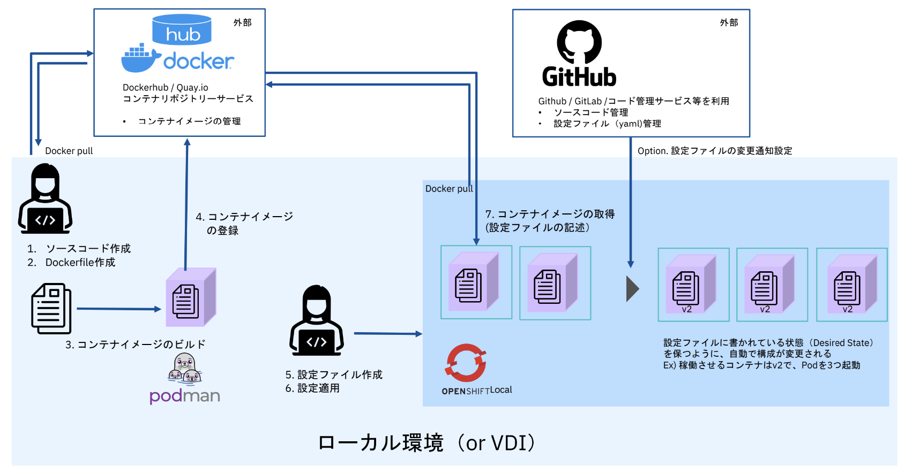

# はじめに

本コンテンツは2023年8月1日実施予定のコンテナ・ハンズオンの講義資料です。内容については今後も継続して更新される点をご了承ください。コンテナ編/コンテナオーケストレーション編をを実施いただくことで、基礎的な内容をマスターいただけます。コンテナのメリット、開発から運用までのイメージをつけていただけると思います。ただし、あくまでも入門（101）内容のため、より深いスキルを身に着けたい方はRedHat社が提供する研修の受講もご検討ください。

## ハンズオン環境と前提条件

本ハンズオンは以下のような構成で実施します。コンテナエンジンとしてPodman、オーケストレーションツールとしてOpenShift Localをを利用していきます。  
コンテナと聞くと、Dockerを思い浮かべる方が多いと思いますが、**RHEL8、CentOS8以降ではDockerのサポートは廃止されており**、Podmanが採用されています。今回のハンズオンでは、コンテナの操作にPodmanを使用していきます。

また、第一部/第二部ともにRed Hat OpenShift Localのインストールが完了している想定です。未実施の場合は[ガイド](https://code.visualstudio.com/download)の手順を参考に、導入をお願いいたします。  
!!! warning
    最新版2.19はWindows11 Proでも問題なく動作することを検証済みです。古いバージョンを導入した場合、本ハンズオンの内容を正常に実施できない可能性がありますのでご注意ください。

ハンズオンの中では各種設定ファイルをyaml形式で作成・編集していきます。お使いのテキストエディタで実施いただいて問題ありません。特にこだわりや社内の制限がない方は、[VisualStudio Code](https://code.visualstudio.com/download)の導入をおすすめいたします。

---
## **アジェンダ**
### 第一部 コンテナ編
[home]:localhost:8000
1. [OpenShift Localの実行](/container-hands-on/100-prerequired/)
2. [コンテナファイルの基本記述](/container-hands-on/101-container_file/)
3. [コンテナ・イメージのビルド](/container-hands-on/103-container-build/)
4. [複数のコンテナを連携する](/container-hands-on/104-Integration-ap_and_db.md/)
5. [コンテナリポジトリーへのpush](/container-hands-on/105-container_image_registry.md//)

### 第二部 コンテナオーケストレーション編

